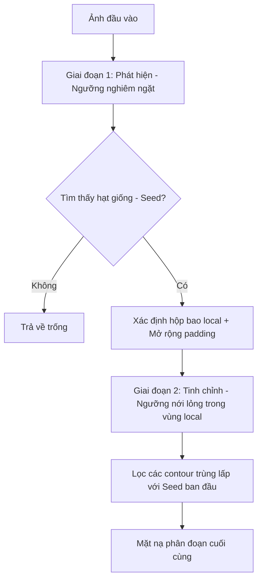

# Tóm tắt các thay đổi trong thuật toán xử lý ảnh (`cv.py`)

Bạn đã thực hiện một cải tiến lớn trong file [cv.py](file:///home/dungmn3/lingtingthings/thesis_src/knee_segmentation/cv.py) bằng cách chuyển đổi từ thuật toán phân đoạn một giai đoạn (single-stage) sang **quy trình phân đoạn hai giai đoạn (two-stage: detect + refine)**. Dưới đây là chi tiết các thay đổi cấu hình và luồng xử lý:

---

## 1. So sánh tham số cấu hình và bộ lọc hình học

Các tham số mặc định của hàm `segment_baker_cyst` đã được nới lỏng và điều chỉnh lại để tăng khả năng bao phủ vùng nang, cụ thể:

| Tham số | Giá trị cũ | Giá trị mới | Ý nghĩa & Tác động |
| :--- | :---: | :---: | :--- |
| **Kích thước nhân Morphology** | `(7, 7)` | `(5, 5)` | Nhân nhỏ hơn giúp giữ chi tiết biên dạng tốt hơn. |
| **Số lần lặp phép toán hình thái** | `2` | `1` | Tránh làm biến dạng hoặc mất các phần nang nhỏ. |
| **Giới hạn ROI (Top, Bottom)** | `[0.20, 0.70]` | `[0.15, 0.80]` | Mở rộng vùng quét theo chiều dọc để tránh bỏ sót nang nằm cao/thấp. |
| **Giới hạn ROI (Left, Right)** | `[0.10, 0.90]` | `[0.05, 0.95]` | Mở rộng vùng quét theo chiều ngang. |
| **Diện tích nang tối thiểu (`area_min`)** | `500` | `400` | Cho phép phát hiện các nang kích thước nhỏ hơn. |
| **Diện tích nang tối đa (`area_max`)** | `25000` | `40000` | Tránh bỏ sót các nang dịch cực đại. |
| **Aspect Ratio (`aspect_ratio_min / max`)**| `[1.2, 4.0]` | `[0.4, 5.0]` | Cho phép nhận diện nang dẹt đứng (`<1.0`) hoặc rất dẹt ngang (`>4.0`). |
| **Độ đặc (`solidity_min`)** | `0.75` | `0.65` | Chấp nhận các nang có hình dạng lồi lõm hoặc phức tạp hơn. |
| **Độ bao phủ (`extent_min`)** | `0.45` | `0.40` | Nới lỏng độ phủ hộp bao quanh. |
| **Điểm thưởng nửa trên (`upper_half_bonus`)**| `0.25` | `0.15` | Giảm bớt thiên kiến vị trí để dựa nhiều hơn vào hình học thực tế. |
| **`detect_offset` (Mới)** | -- | `-28` | Ngưỡng trừ thêm so với Otsu dùng cho giai đoạn phát hiện (khắt khe). |
| **`refine_offset` (Mới)** | -- | `-5` | Ngưỡng trừ thêm so với Otsu dùng cho giai đoạn tinh chỉnh (nới lỏng). |

---

## 2. Quy trình phân đoạn 2 giai đoạn (Two-Stage Segmentation Pipeline)

Thay đổi cốt lõi nằm ở cơ chế phân đoạn nhị phân kết hợp để tối ưu hóa đồng thời cả **Precision** (Độ chính xác) và **Recall** (Độ phủ):

### Giai đoạn 1: Phát hiện nang giống (Detect Stage)
* **Ý tưởng:** Sử dụng một ngưỡng phân ngưỡng rất khắt khe (nghiêm ngặt): Ngưỡng phát hiện = Ngưỡng Otsu + `detect_offset` (`-28`).
* **Mục tiêu:** Chỉ giữ lại những vùng cực tối (lõi dịch của nang Baker), loại bỏ hầu hết nhiễu nền hoặc các cấu trúc mô mềm khác.
* **Kết quả:** Sau khi lọc hình học và tính điểm (scoring), thuật toán chọn ra một contour tốt nhất làm **"nang giống" (seed contour)** với độ tin cậy rất cao (High Precision).

### Giai đoạn 2: Tinh chỉnh và Mở rộng (Refine Stage)
* **Ý tưởng:** Xung quanh nang giống đã phát hiện, chúng ta muốn mở rộng để lấy trọn vẹn phần rìa dẹt mờ của nang vốn bị lọc mất ở Giai đoạn 1.
* **Cách thực hiện:**
  1. Cắt một vùng cục bộ (local region) xung quanh hạt giống bằng cách mở rộng Bounding Box của nó thêm $50\%$ kích thước mỗi chiều (`pad_x`, `pad_y`).
  2. Áp dụng phân ngưỡng nới lỏng (permissive threshold) trong vùng này: Ngưỡng tinh chỉnh = Ngưỡng Otsu + `refine_offset` (`-5`). Ngưỡng này cao hơn nhiều so với ngưỡng phát hiện, giúp bắt được cả các vùng dịch xám mờ ở biên nang.
  3. Chạy lọc nhiễu nhẹ bằng morphology và tìm các contour cục bộ mới.
  4. Chỉ giữ lại các contour cục bộ nào **giao nhau (overlap)** với hạt giống ban đầu để tránh lấy nhầm các cấu trúc tối khác xung quanh.
  5. Nếu quá trình tinh chỉnh bị lỗi hoặc không tạo ra kết quả, thuật toán sẽ tự động quay về sử dụng hạt giống ban đầu làm phân đoạn cuối cùng để đảm bảo tính an toàn.

---

## 3. Đánh giá ưu điểm của thuật toán mới
* **Tăng Recall đáng kể:** Khắc phục được nhược điểm lớn nhất của phương pháp xử lý ảnh cũ là bỏ sót các phần rìa nang hoặc không lấy đủ diện tích thực tế của nang do phân ngưỡng tĩnh quá sâu.
* **Duy trì Precision cao:** Nhờ việc phát hiện ban đầu bằng ngưỡng nghiêm ngặt (`-28`), thuật toán tránh được việc kích hoạt phân đoạn sai trên các vùng cơ hoặc bóng cản âm của xương.
* **Thích ứng động:** Cơ chế khoanh vùng local và dùng ngưỡng tinh chỉnh nới lỏng giúp thuật toán thích nghi tốt hơn với độ tương phản thay đổi của từng bức ảnh siêu âm.
